# Total Charm Dent
## საიტის მართვის სახელმძღვანელო

**ვერსია 1.0** · totalcharmdent.ge

ეს სახელმძღვანელო განკუთვნილია Total Charm Dent-ის თანამშრომლებისთვის, რომლებიც მართავენ კლინიკის ვებგვერდის ინფორმაციას, კონტენტს, ჩაწერის მოთხოვნებსა და სარეკლამო გვერდებს.

ადმინისტრაციული პანელის გამოყენებისთვის პროგრამირების ცოდნა საჭირო არ არის.

**როგორ იკითხება ეს დოკუმენტი.** თავები 1–3 ყველამ უნდა წაიკითხოს — ეს არის მინიმუმი, რომლის გარეშეც პანელში მუშაობა არ გამოვა. დანარჩენი თავები საცნობაროა: გახსენი ის, რომელიც შენს ამოცანას ეხება. თუ არ იცი რომელი, იხილე **დანართი ბ — სად რა იცვლება**.

---

## სარჩევი

**საწყისი**
1. სისტემის შესახებ
2. სისტემაში შესვლა და ნავიგაცია
3. ჩაწერის მოთხოვნები

**საიტის შიგთავსი**
4. კლინიკის მონაცემები
5. სიახლეები
6. სერვისები
7. ექიმები
8. აპარატურა
9. კითხვა-პასუხი
10. ფოტოები

**მარკეტინგი**
11. ლენდინგ გვერდები
12. Google-ის ტექსტები
13. საკვანძო სიტყვები
14. სტატისტიკა

**ადმინისტრირება**
15. პარამეტრები
16. პრობლემების სწრაფი მოგვარება

**დანართები**
- ა. ვინ რას ხედავს
- ბ. სად რა იცვლება — ანბანური საძიებელი
- გ. რა იცვლება ენების მიხედვით

---

# 1. სისტემის შესახებ

Total Charm Dent-ის ვებგვერდს აქვს საკუთარი ადმინისტრაციული პანელი, საიდანაც ხდება საიტის ყოველდღიური მართვა პროგრამისტის ჩარევის გარეშე.

ადმინისტრაციული პანელიდან შეგიძლია:

- ნახო და დაამუშაო პაციენტების ჩაწერის მოთხოვნები;
- შეცვალო კლინიკის ტელეფონი, ელ. ფოსტა, მისამართი და სამუშაო საათები;
- დაამატო ან შეცვალო ექიმების პროფილები;
- მართო სერვისები და აპარატურა;
- გამოაქვეყნო სიახლეები და სტატიები;
- შეცვალო კითხვა-პასუხი;
- ატვირთო ფოტოები;
- შექმნა სარეკლამო კამპანიის გვერდები;
- შეცვალო ის სათაურები და აღწერები, რომლებიც Google-ის შედეგებში ჩანს.

შენახვის შემდეგ ცვლილება საიტზე ავტომატურად აისახება — გვერდი თავად განახლდება, სერვერის გადატვირთვა საჭირო არ არის.

## მენიუს ოთხი ჯგუფი

მარცხენა მენიუ ოთხ ჯგუფად იყოფა. ჯგუფები დალაგებულია იმის მიხედვით, თუ რამდენად ხშირად მუშაობს მათთან თანამშრომელი — ზემოთ ის, რასაც ყოველდღე ხსნი.

<figure>
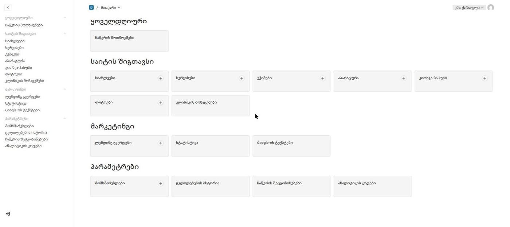
<figcaption>მთავარი ეკრანი. მარცხნივ — ოთხივე ჯგუფი; ცენტრში იგივე ეკრანები ბარათებად.</figcaption>
</figure>


### ყოველდღიური

| ეკრანი | რა არის |
|---|---|
| **ჩაწერის მოთხოვნები** | ვებგვერდიდან შემოსული პაციენტების მოთხოვნები |

ერთადერთი ეკრანი ამ ჯგუფში — და ერთადერთი, რომელსაც რეგისტრატორი დღეში რამდენჯერმე ხსნის. სწორედ ამიტომ დგას ის ცალკე, მენიუს თავში, და არა შიგთავსის კოლექციებს შორის.

### საიტის შიგთავსი

| ეკრანი | რა არის |
|---|---|
| **სიახლეები** | სიახლეები და სტატიები — ერთადერთი ადგილი, სადაც მონახაზი არსებობს |
| **სერვისები** | 16 სერვისი, ხუთ მიმართულებად დაჯგუფებული |
| **ექიმები** | კლინიკის გუნდი |
| **აპარატურა** | აპარატები და სისტემები |
| **კითხვა-პასუხი** | ხშირად დასმული კითხვები, მთავარ გვერდზე |
| **ფოტოები** | საიტის ყველა სურათი — ერთი ბიბლიოთეკა |
| **კლინიკის მონაცემები** | ტელეფონი, ფოსტა, მისამართი, საათები, ფასები |

### მარკეტინგი

| ეკრანი | რა არის |
|---|---|
| **ლენდინგ გვერდები** | სარეკლამო კამპანიის ცალკეული გვერდები |
| **სტატისტიკა** | ანონიმური დღიური ჯამები _(მხოლოდ ადმინისტრატორი)_ |
| **Google-ის ტექსტები** | სათაურები და აღწერები ძებნის შედეგებისთვის |

### პარამეტრები

| ეკრანი | რა არის |
|---|---|
| **მომხმარებლები** | ვის შეუძლია პანელში შესვლა |
| **ცვლილებების ისტორია** | ვინ, რა და როდის შეცვალა _(მხოლოდ ადმინისტრატორი)_ |
| **ჩაწერის შეტყობინებები** | სად მოდის შეტყობინება ახალ ჩაწერაზე _(მხოლოდ ადმინისტრატორი)_ |
| **ანალიტიკის კოდები** | GA4 და Meta Pixel _(მხოლოდ ადმინისტრატორი)_ |

## მომხმარებლის ორი როლი

### რედაქტორი

მართავს ვებგვერდის ყოველდღიურ შიგთავსსა და ჩაწერის მოთხოვნებს. შეუძლია საკუთარი სახელისა და პაროლის შეცვლა — მეტი არაფერი ანგარიშებთან დაკავშირებით.

### ადმინისტრატორი

იგივე, პლუს: ანგარიშების დამატება-წაშლა, როლების მინიჭება, ტექნიკური პარამეტრები, ცვლილებების ისტორია და სტატისტიკა.

**თუ რომელიმე ეკრანს მენიუში ვერ ხედავ**, ეს არ არის ხარვეზი — ის შენი როლისთვის დამალულია. სრული ცხრილი: **დანართი ა**.

---

# 2. სისტემაში შესვლა და ნავიგაცია

## შესვლა

გახსენი:

```
totalcharmdent.ge/admin
```

შესვლის გვერდზე შეიყვანე ელ. ფოსტა და პაროლი, შემდეგ დააჭირე **შესვლას**.

თუ პაროლი დაგავიწყდა — გვერდზეა ბმული **„პაროლი დაგავიწყდა?“**. აღდგენის წერილი შენს ელ. ფოსტაზე მოვა.

> **შენიშვნა.** ტექსტი „ელ. ფოსტა ან პაროლი არასწორია“ განზრახ არ ამბობს რომელი — ეს უსაფრთხოების ჩვეულებრივი პრაქტიკაა.

## მარცხენა მენიუ

ეკრანის მარცხენა მხარეს მდებარეობს მთავარი ნავიგაცია — იგივე ოთხი ჯგუფი, რაც პირველ თავშია აღწერილი.

თუ ზუსტად არ იცი სად უნდა შეცვალო ინფორმაცია, უმეტეს შემთხვევაში პასუხი არის **საიტის შიგთავსი**.

## სამი ენა

ვებგვერდი მუშაობს სამ ენაზე: **ქართული**, **English**, **Русский**.

ქართული არის წყარო ენა: **უთარგმნელი ჩანაწერი საიტიდან არ ქრება** — ის ქართულად გამოჩნდება. ანუ სტატია შეგიძლია მხოლოდ ქართულად გამოაქვეყნო და თარგმანი მოგვიანებით დაამატო.

> **მაგრამ ყურადღება: სავალდებულო ველი სავალდებულოა იმ ენაზე, რომელზეც ინახავ.**
>
> თუ ინგლისურ ენაზე გადართული ხარ და სტატიის სათაური ინგლისურად ცარიელია, შენახვა **არ გამოვა** — მაშინაც კი, თუ ქართული სრულად შევსებულია.
>
> ორი გამოსავალია: ან ინგლისურადაც შეავსე სავალდებულო ველები, ან ქართულზე გადართული დაასრულე მუშაობა.
>
> **გამონაკლისი — ლენდინგ გვერდები.** იქ სავალდებულოობა მხოლოდ ქართულს ეხება, სპეციალურად. იხილე თავი 11.

ველების ნაწილი სამივე ენაზე ცალ-ცალკე ივსება, ნაწილი კი ერთია ყველა ენისთვის. ეს არჩევანი შემთხვევითი არ არის.

**ითარგმნება** — სახელები, აღწერები, ტექსტები, სათაურები, მისამართი, სამუშაო საათები.

**არ ითარგმნება** — ტელეფონი, ელ. ფოსტა, აპარატის მოდელის დასახელება, სოციალური ქსელების ბმულები, ფასები, ფოტოები, მისამართები (slug), რიგითობა.

**აპარატის მოდელი განზრახ არ ითარგმნება.** „Vatech EzRay Air“ ზუსტად ისე იწერება, როგორც მწარმოებელთან — რადგან პაციენტი სწორედ ამ სახელს ეძებს Google-ში. „КТ Vatech“ შეცდომად იკითხება.

სრული ცხრილი: **დანართი გ**.

> **მნიშვნელოვანია.** ტექსტის შეცვლამდე ყოველთვის გადაამოწმე, რომ სწორი ენა გაქვს არჩეული. ენის გადამრთველი ფორმის თავშია.

## ტექსტის რედაქტორი

სამ ველს აქვს ფორმატირების ზოლი: **სტატიის ტექსტი** (თავი 5), **ექიმის ბიოგრაფია** (თავი 7) და **აპარატის ტექსტი** (თავი 8). დანარჩენი ველები მარტივი ტექსტია.

ზოლი ველის თავზე მუდამ ჩანს — მონიშვნა საჭირო არ არის.

### რა არის ზოლზე

| ღილაკი | რას აკეთებს |
|---|---|
| **სათაური** | ტექსტის ნაწილს ყოფს — მთავარი ქვესათაური |
| **ქვესათაური** | სათაურის შიგნით უფრო წვრილი დაყოფა |
| **გამუქება** (**B**) | მნიშვნელოვანი სიტყვა |
| **დახრილი** (*I*) | აქცენტი |
| **ბულეტიანი სია** | ჩამონათვალი, სადაც რიგს მნიშვნელობა არ აქვს |
| **დანომრილი სია** | ნაბიჯები, სადაც რიგს მნიშვნელობა აქვს |
| **ბმული** | სხვა გვერდზე ან სხვა საიტზე |

### სათაური და ქვესათაური

**გამოიყენე „სათაური“ ტექსტის ძირითადი ნაწილების გამოსაყოფად, „ქვესათაური“ კი მათ შიგნით.** მაგალითად, სტატიაში „გათეთრება“:

- **სათაური:** როგორ მუშაობს
- **სათაური:** რეალისტური მოლოდინი
  - **ქვესათაური:** რა არ თეთრდება

**რატომ არის მხოლოდ ორი დონე.** გვერდს უკვე აქვს თავისი მთავარი სათაური — სტატიის სახელი, ექიმის სახელი, აპარატის მოდელი. რედაქტორში დაწერილი სათაური ყოველთვის მის ქვემოთ დგება, ავტომატურად. ამიტომ იმავე დონის მესამე ვარიანტი არ არსებობს: ის ან იმეორებდა უკვე არსებულს, ან გვერდის სტრუქტურას ტეხდა.

> **იგივე ტექსტი სხვადასხვა გვერდზე სხვადასხვა ზომისაა — და ეს სწორია.** ექიმის ბიოგრაფიაში „სათაური“ უფრო წვრილია, ვიდრე სტატიაში, რადგან ბიოგრაფია გვერდის ნაწილია, სტატია კი — მთელი გვერდი. შენ სტრუქტურას წერ; ზომას გვერდი ირჩევს.

### რაც ზოლზე არ არის

შრიფტის ზომა, ფერი, ცენტრირება და ტექსტში ჩასმული სურათი **განზრახ არ არის.** საიტის ტიპოგრაფია ერთიანია — ტექსტი ავტომატურად სწორ შრიფტსა და ზომას იღებს. ხელით შეცვლილი ზომა პირველივე დიზაინის განახლებისას გაუწონასწორდებოდა.

> **ზოლზე მხოლოდ ის ღილაკებია, რომლებიც საიტზე მართლა მუშაობს.** თუ ღილაკი აქ არის, შედეგი გვერდზეც გამოჩნდება.

## შენახვა

ინფორმაციის შეცვლის შემდეგ დააჭირე **შენახვას**. საიტის შესაბამისი გვერდი ავტომატურად განახლდება.

თუ ცვლილება რამდენიმე გვერდს ეხება, ისინი ერთდროულად განახლდება. მაგალითად, ექიმის შეცვლა ერთდროულად ანახლებს მთავარ გვერდსა და „ჩვენს შესახებ“-ს.

## მონახაზი და გამოქვეყნება

**მონახაზი მთელ სისტემაში მხოლოდ ერთ ადგილას არსებობს — სიახლეებში.**

იქ ორი ღილაკია: **მონახაზის შენახვა** და **გამოქვეყნება**. ნახევრად დაწერილი სტატია საიტზე არ ჩანს, სანამ არ გამოაქვეყნებ.

დანარჩენ ეკრანებზე **შენახვა ნიშნავს გამოქვეყნებას**. თუ გინდა, რომ ჩანაწერი მოამზადო და ჯერ არ აჩვენო, თითოეულ ადგილას თავისი მექანიზმია:

| სად | როგორ დამალო |
|---|---|
| სიახლეები | **მონახაზის შენახვა** — არ დააჭირო „გამოქვეყნებას“ |
| ექიმები | ჩექბოქსი **„საიტზე გამოჩნდეს“** გამორთული დატოვე |
| აპარატურა | ჩექბოქსი **„ფოტო ჯერ არ არის“** ჩართული — ბარათი ჩანს, ფოტოს ნაცვლად წარწერა |
| ლენდინგ გვერდები | სტატუსი **„მუშავდება (არავინ ხედავს)“** |
| სერვისები, კითხვა-პასუხი | დამალვის საშუალება არ არის — შენახვა = გამოქვეყნება |

## გასვლა

სამუშაოს დასრულების შემდეგ დააჭირე **გასვლას** — განსაკუთრებით იმ კომპიუტერზე, რომელსაც რამდენიმე თანამშრომელი იყენებს.

---

# 3. ჩაწერის მოთხოვნები

**მენიუ:** ყოველდღიური → ჩაწერის მოთხოვნები

ეს არის ის ერთი ეკრანი, რომელსაც კლინიკა ყოველდღე ხსნის.

## სია

უახლესი მოთხოვნები ყოველთვის ზემოთაა. სიაში ჩანს:

| სვეტი | |
|---|---|
| თარიღი | როდის შემოვიდა |
| სახელი | პაციენტის სახელი — ამაზე უნდა დააჭირო |
| ტელეფონი | |
| მიმართულება | რა აირჩია პაციენტმა |
| სტატუსი | სად არის დამუშავების პროცესი |

**ძებნა** მუშაობს სახელზე, ტელეფონზე, ელ. ფოსტასა და მიმართულებაზე.

<figure>
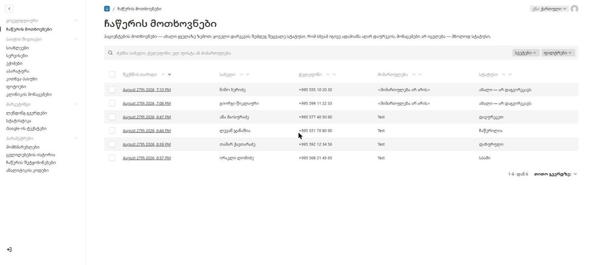
<figcaption>სია. უახლესი ზემოთ; სტატუსი ბოლო სვეტშია. სახელები და ნომრები ილუსტრაციისთვისაა შეცვლილი.</figcaption>
</figure>


## მოთხოვნის გახსნა

დააჭირე პაციენტის სახელს.

**ყველა მონაცემი, რომელიც პაციენტმა გამოგზავნა, მხოლოდ წასაკითხია.** სახელი, ტელეფონი, ფოსტა, მიმართულება, სასურველი დრო, შეტყობინება — ვერცერთს ვერ შეცვლი. ეს განზრახაა: მოთხოვნა იმის ჩანაწერია, რაც პაციენტმა რეალურად დაწერა.

**სტატუსი ერთადერთი ველია, რომელიც აქ იცვლება.** ის მარჯვენა გვერდით სვეტშია, არა ტექსტებს შორის — რომ დაუყოვნებლივ მისწვდე, მთელი მოთხოვნის გადაქაჩვის გარეშე.

<figure>
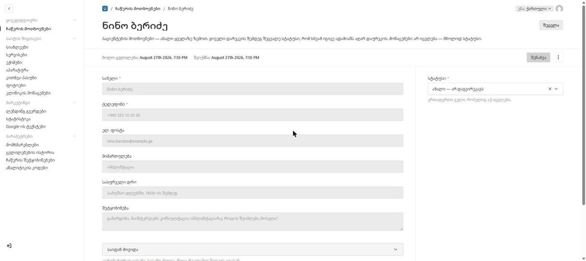
<figcaption>გახსნილი მოთხოვნა. მარცხნივ ნაცრისფერი — მხოლოდ წასაკითხი; მარჯვნივ სტატუსი — ერთადერთი ცვალებადი ველი.</figcaption>
</figure>


## სტატუსები

| სტატუსი | რას ნიშნავს |
|---|---|
| **ახალი — არ დაგვირეკავს** | ჯერ არავინ დაუკავშირდა. პირველ რიგში ესენი. |
| **დავურეკეთ** | თანამშრომელი უკვე დაუკავშირდა პაციენტს. |
| **ჩაწერილია** | ვიზიტის დრო შეთანხმებულია. |
| **დახურული** | დამატებითი მოქმედება არ არის საჭირო — პაციენტმა გადაიფიქრა ან საკითხი სხვაგვარად გადაწყდა. |
| **სპამი** | არ არის რეალური პაციენტის მოთხოვნა. |

## რეკომენდებული პროცესი

ტიპური გზა:

**ახალი → დავურეკეთ → ჩაწერილია**

თუ ვიზიტი არ დაიგეგმა:

**ახალი → დავურეკეთ → დახურული**

სტატუსი შეცვალე **ყოველი დარეკვის შემდეგ, მაშინვე**. ეს არ არის ბიუროკრატია — ეს ის ერთადერთი მექანიზმია, რომელიც აჩერებს ორ თანამშრომელს ერთსა და იმავე ადამიანთან განმეორებით დარეკვისგან.

## საიდან მოვიდა

მოთხოვნის გვერდზე არის დაკეცილი ბლოკი **„საიდან მოვიდა“**.

ის ავტომატურად ივსება და მასში ჩანს, რომელმა რეკლამამ მოიყვანა პაციენტი: ლენდინგის მისამართი, კამპანიის სახელი, წყარო, არხი და კამპანიის ტექნიკური ნიშნები (utm).

**ამ მონაცემების შეცვლა არ არის საჭირო და შეუძლებელიცაა** — ისინი წასაკითხია. სასარგებლოა მაშინ, როცა რეკლამის შედეგს აფასებ.

## შეტყობინებების სტატუსი

ახალი მოთხოვნის შემოსვლისას სისტემა კლინიკას აგზავნის შეტყობინებას — ელ. ფოსტით და Telegram-ით. მათი შედეგი ცალკე დაკეცილ ბლოკშია.

| სტატუსი | |
|---|---|
| **გაგზავნილია** | წარმატებით გაიგზავნა |
| **მოლოდინში** | გაგზავნის პროცესი ჯერ არ დასრულებულა |
| **ვერ გაიგზავნა** | გაგზავნისას მოხდა შეცდომა — ტექსტი ქვემოთ წერია |
| **გამოტოვებულია** | ეს არხი არ იყო ჩართული |

> **მნიშვნელოვანია.** შეტყობინების გაგზავნის შეცდომა **არ ნიშნავს, რომ პაციენტის მოთხოვნა დაიკარგა.** მოთხოვნა ბაზაშია, ამ ეკრანზე ჩანს, და მისი დამუშავება ჩვეულებრივ შეგიძლია. ერთადერთი, რაც მოხდა — შენ ვერ მიიღე შეტყობინება; ამიტომ ეს ეკრანი დღეში რამდენჯერმე გახსენი, მხოლოდ შეტყობინებას ნუ დაეყრდნობი.

## წაშლა

მოთხოვნის წაშლა შეუძლია მხოლოდ ადმინისტრატორს. სპამისთვის წაშლა საჭირო არ არის — მიანიჭე სტატუსი **„სპამი“** და ის სიაში დარჩება.

---

# 4. კლინიკის მონაცემები

**მენიუ:** საიტის შიგთავსი → კლინიკის მონაცემები

აქ ინახება ის ინფორმაცია, რომელიც საიტის ყველა გვერდზეა და Google-საც მიეწოდება. **აქ დაშვებული შეცდომა ყველგან ჩანს.**

ეკრანი ხუთ დაკეცილ ბლოკად იყოფა.

<figure>
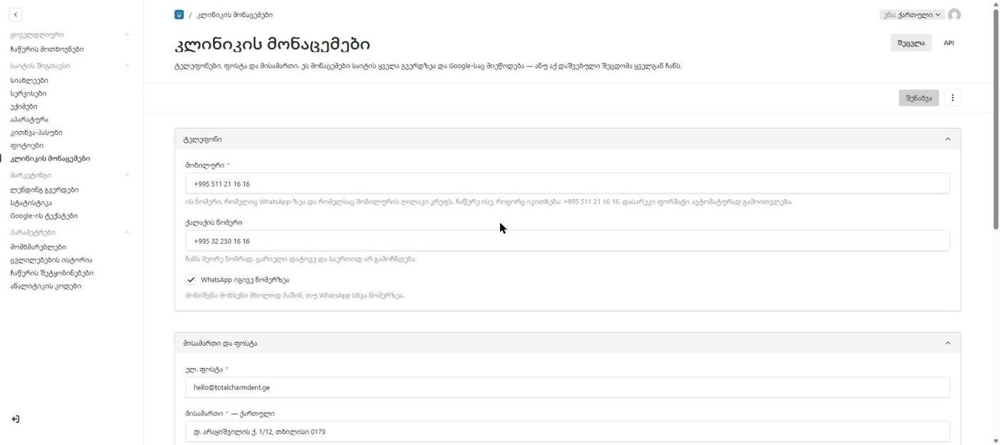
<figcaption>„ტელეფონი“ ბლოკი გახსნილი. თითოეული ველის ქვემოთ ახსნაა — რა მოხდება, თუ შეცვლი.</figcaption>
</figure>


---

## ტელეფონი

| ველი | |
|---|---|
| **მობილური** | სავალდებულო. ის ნომერი, რომელიც WhatsApp-ზეა და რომელსაც მობილურის ღილაკი კრეფს. |
| **ქალაქის ნომერი** | არასავალდებულო. ჩანს მეორე ნომრად. ცარიელი დატოვე და საერთოდ არ გამოჩნდება. |
| **WhatsApp იგივე ნომერზეა** | ჩართულია ნაგულისხმევად. |
| **WhatsApp-ის ნომერი** | ჩნდება მხოლოდ მაშინ, თუ ზემოთ მონიშვნა მოხსენი. |

**ნომერი ჩაწერე ისე, როგორც იკითხება:**

```
+995 511 21 16 16
```

დასარეკი ფორმატი (`995511211616`) ავტომატურად გამოითვლება — მისი ცალკე შეყვანა საჭირო არ არის. ეს განზრახაა: ორი ველი, რომელსაც ხელით უნდა ეთანხმებოდე, ადრე თუ გვიან განსხვავდება, და შეცდომა ჩუმია — ეკრანზე სწორი ნომერი წერია, ღილაკი კი სხვას რეკავს.

### სად აისახება

ერთი ნომრის შეცვლა ცვლის:

- საიტის ზედა ზოლს;
- ფუტერს;
- მობილურის სწრაფი ზარის ღილაკს;
- WhatsApp-ის ღილაკს;
- საკონტაქტო გვერდს;
- Google-ისთვის განკუთვნილ სტრუქტურირებულ მონაცემებს.

ამიტომ ნომრის შეცვლის შემდეგ სისწორის შემოწმება განსაკუთრებით მნიშვნელოვანია.

---

## მისამართი და ფოსტა

| ველი | ითარგმნება? | |
|---|---|---|
| **ელ. ფოსტა** | არა | სავალდებულო. კლინიკის საჯარო საკონტაქტო ფოსტა. |
| **მისამართი** | **დიახ** | სავალდებულო. ისე, როგორც კონტაქტის გვერდსა და საიტის ბოლოში უნდა ეწეროს. |
| **Google Maps-ის ბმული** | არა | ღილაკი „როგორ მოვიდეთ“ ამ ბმულს ხსნის. |
| **სამუშაო საათები** | **დიახ** | წინადადებად: „ყოველდღე 9:00-დან 21:00-მდე“. |

> **ეს არ არის ის ფოსტა, სადაც ჩაწერის შეტყობინებები მოდის.** ეს საჯარო მისამართია, რომელსაც პაციენტი ხედავს. შეტყობინებების მისამართი ცალკე პარამეტრია — იხილე თავი 15.

> **სამუშაო საათებზე მნიშვნელოვანი გაფრთხილება.** ეს ველი ცვლის მხოლოდ იმ ტექსტს, რომელსაც ადამიანი კითხულობს. **Google-ისთვის განკუთვნილი სტრუქტურირებული ვერსია კოდშია ჩაწერილი და ავტომატურად არ იცვლება.** თუ კლინიკის რეალური სამუშაო საათები შეიცვალა — არა უბრალოდ ფორმულირება, არამედ თავად საათები — ამის შესახებ დეველოპერს უნდა აცნობო. წინააღმდეგ შემთხვევაში საიტი ერთს დაწერს, Google კი სხვას აჩვენებს.

---

## კონსულტაციის ფასი

| ველი | |
|---|---|
| **პირველადი კონსულტაცია (₾)** | სავალდებულო |
| **განმეორებითი კონსულტაცია (₾)** | სავალდებულო |

ფასი ჩანს სერვისებისა და სიახლეების გვერდებზე და Google-საც მიეწოდება.

> **ფასის შეცვლის შემდეგ გადახედე კითხვა-პასუხს.** ერთ პასუხში თანხა ჩვეულებრივი წინადადების ნაწილად წერია და ავტომატურად არ იცვლება. იგივე ეხება სტატიებსა და სერვისების აღწერებს.

---

## გამოქვეყნებული ციფრები

| ველი | |
|---|---|
| **კმაყოფილი პაციენტების %** | არასავალდებულო, 0–100 |
| **წლები ბაზარზე** | არასავალდებულო |

**ორივე არასავალდებულოა და ორივე მტკიცებაა.** ცარიელი ველი ნიშნავს, რომ ის მრიცხველი საიტზე უბრალოდ არ გამოჩნდება — და ეს სწორი გადაწყვეტილებაა, თუ ციფრს დასაყრდენი არ აქვს.

სამედიცინო საიტზე დაუსაბუთებელი პროცენტი რისკია. გამოაქვეყნე მხოლოდ ის, რისი დადასტურებაც შეგიძლია.

დანარჩენი ორი ციფრი, რომელსაც საიტი აჩვენებს — რამდენი სპეციალისტი და რამდენი სერვისი — **ავტომატურად ითვლება**. მათი ხელით შეყვანა არსად არის საჭირო.

---

## სოციალური ქსელები

| ველი | |
|---|---|
| **Facebook** | სრული ბმული |
| **Instagram** | სრული ბმული |
| **Google Business Profile** | სრული ბმული |

ყოველთვის სრული მისამართი, არა მომხმარებლის სახელი.

**Google Business Profile ყველაზე ძლიერი ნდობის ბმულია, რაც ადგილობრივ კლინიკას შეიძლება ჰქონდეს** — ის საიტს იმ ჩანაწერს უკავშირებს, რომელსაც Google რუკებზე უკვე აჩვენებს, შეფასებებითა და ფოტოებით.

---

## როგორ შევამოწმო ცვლილება

1. დააჭირე **შენახვას**;
2. გახსენი ვებგვერდი;
3. გადადი იმ ადგილას, სადაც შეცვლილი ინფორმაცია ჩანს;
4. გადაამოწმე ახალი მნიშვნელობა;
5. თუ ველი ითარგმნება — შეამოწმე English და Русский ვერსიებიც.

ტელეფონის შეცვლისას შესამოწმებელი მინიმუმი: ზედა ზოლი, ფუტერი, მობილურის ზარის ღილაკი, კონტაქტის გვერდი.

---

# 5. სიახლეები

**მენიუ:** საიტის შიგთავსი → სიახლეები

სიახლეები და სტატიები. **ეს ერთადერთი ეკრანია, სადაც მონახაზი არსებობს** — ანუ ერთადერთი, სადაც ტექსტი შეგიძლია შეინახო ისე, რომ საიტზე არ გამოჩნდეს.

<figure>
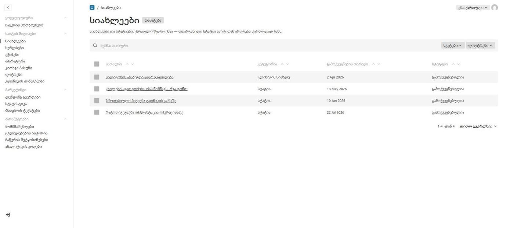
<figcaption>სიახლეების სია. ბოლო სვეტი აჩვენებს, გამოქვეყნებულია თუ მონახაზად დარჩა.</figcaption>
</figure>


## ორი კატეგორია

| კატეგორია | რისთვის |
|---|---|
| **კლინიკის სიახლე** | რა ხდება კლინიკაში — ახალი აპარატი, ახალი ექიმი, ღონისძიება |
| **სტატია** | სასარგებლო ტექსტი პაციენტისთვის |

## ველები

### მთავარ სვეტში

| ველი | სავალდებულო | ითარგმნება |
|---|---|---|
| **სათაური** | ✓ | ✓ |
| **მთავარი სურათი** | ✓ | — |
| **მოკლე აღწერა** | ✓ | ✓ |
| **ტექსტი** | ✓ | ✓ |

**ტექსტს** ფორმატირების ზოლი აქვს — სათაური, ქვესათაური, სიები, ბმულები, გამუქება. იხილე **თავი 2 → ტექსტის რედაქტორი**.

**მოკლე აღწერა** ერთი-ორი წინადადებაა. ის ჩანს ბარათზე სიაში **და Google-ის შედეგებში** — ანუ ხშირად სწორედ ის იკითხება სტატიაზე ადრე. დაწერე ისე, თითქოს ეს ერთადერთია, რასაც წაიკითხავენ.

### გვერდით სვეტში

| ველი | |
|---|---|
| **მისამართი (slug)** | ავტომატურად ივსება სათაურიდან |
| **კატეგორია** | სავალდებულო |
| **გამოქვეყნების თარიღი** | სავალდებულო |

**მისამართი (slug)** არის URL-ის ბოლო ნაწილი: `/ka/news/მისამართი`. ის ლათინური ასოებით იწერება და **სამივე ენას ერთი და იგივე აქვს** — ეს განზრახაა, რომ ერთი სტატია საკუთარ თავს ძებნის შედეგებში არ ეჯიბროს.

> **არსებული მისამართი ავტომატურად არასდროს გადაიწერება.** თუ სათაურში შეცდომას ასწორებ, ბმული, რომელიც ვიღაცამ უკვე გააზიარა, მუშაობას აგრძელებს.

### Google-ის ჩანაწერი (დაკეცილი ბლოკი)

| ველი | |
|---|---|
| **სათაური Google-ისთვის** | სასურველია ~60 სიმბოლო · ველი იტევს მაქსიმუმ 65-ს |
| **აღწერა Google-ისთვის** | სასურველია ~155 სიმბოლო · ველი იტევს მაქსიმუმ 175-ს |
| **საკვანძო სიტყვა** | შიდა ჩანაწერი — გვერდზე არ ჩნდება |

**პირველი ორი ცარიელი დატოვე და Google აიღებს ზემოთ დაწერილ სათაურსა და მოკლე აღწერას — უმეტეს შემთხვევაში სწორედ ესაა საჭირო.** შეავსე მხოლოდ მაშინ, თუ სათაური გვერდზე კარგად იკითხება, ძებნის სიაში კი — არა.

**საკვანძო სიტყვა სხვა ჯიშისაა: ის არსად ქვეყნდება.** ეს შენი ჩანაწერია — რომელ ძებნაზე მუშაობს ეს სტატია (მაგ.: „კბილის გათეთრება ფასი“) — რომ ტექსტის წერისას თვალწინ გქონდეს, და რომ ერთი წლის შემდეგ სხვამაც იცოდეს, რაზე იყო ეს გვერდი დაწერილი. Google მას ვერ ხედავს.

> **რატომ არ ეგზავნება Google-ს.** ოდესღაც არსებობდა „keywords“ თეგი, რომელშიც საძიებო სიტყვები ჩაიწერებოდა. Google-მა მისი კითხვა **2009 წელს** შეწყვიტა, რადგან ის ძალიან ადვილად ივსებოდა ტყუილით. დღეს მისი გამოქვეყნება არაფერს იძლევა — მხოლოდ კონკურენტს აჩვენებს, რომელ სიტყვებზე მუშაობ. ამიტომ ველი პანელში რჩება და საიტზე არ გადის.

## მონახაზი და გამოქვეყნება

ორი ღილაკია:

- **მონახაზის შენახვა** — ტექსტი ინახება, საიტზე არ ჩანს;
- **გამოქვეყნება** — ტექსტი საიტზე გამოდის.

გამოქვეყნებულ სტატიაში ცვლილება რომ შეიტანო და ჯერ არ აჩვენო — შეინახე მონახაზად. საიტზე ძველი, გამოქვეყნებული ვერსია დარჩება, სანამ **„ცვლილებების გამოქვეყნებას“** არ დააჭერ.

---

# 6. სერვისები

**მენიუ:** საიტის შიგთავსი → სერვისები

16 სერვისი, ხუთ მიმართულებად დაჯგუფებული.

> **ცალკე სერვისს საკუთარი გვერდი არ აქვს.** ის თავისი მიმართულების გვერდზე ჩნდება, ბლოკის სახით. ამიტომ სერვისს Google-ის ცალკე სათაური არ სჭირდება — და არც აქვს.

## ხუთი მიმართულება

- დიაგნოსტიკა და დაგეგმვა
- თერაპია და პროფილაქტიკა
- ქირურგია და იმპლანტაცია
- ორთოდონტია
- ესთეტიკური სტომატოლოგია

## ველები

### მთავარ სვეტში

| ველი | სავალდებულო | ითარგმნება |
|---|---|---|
| **დასახელება** | ✓ | ✓ |
| **ერთი წინადადება** | ✓ | ✓ |
| **შესავალი** | — | ✓ |
| **რას მოიცავს** | — | ✓ |

**ერთი წინადადება** ჩანს ბარათზე და ზედა მენიუში. მოკლედ — რას აკეთებს.

**შესავალი** გრძელი აბზაცია მიმართულების გვერდის დასაწყისში.

**რას მოიცავს** — სია. თითო პუნქტი ცალკე სტრიქონად ემატება.

### გვერდით სვეტში

| ველი | |
|---|---|
| **მისამართი (slug)** | სავალდებულო |
| **მიმართულება** | სავალდებულო |
| **რიგითობა** | სავალდებულო. რაც უფრო მცირე რიცხვია, მით ზემოთ. |

> ## ⚠ სერვისის მისამართს ხელი არ ახლო
>
> ეს ერთადერთი მისამართია მთელ სისტემაში, რომელიც **ავტომატურად არ ივსება** — და ერთადერთი, რომლის შეცვლაც რაღაცას ტეხს.
>
> **ხატულა სწორედ ამ მისამართით არჩევა.** თუ მისამართს შეცვლი, სერვისი ხატულის გარეშე დარჩება — და შეცდომა ჩუმია: არაფერი გაფრთხილებს, უბრალოდ ბარათი ცარიელი ხდება.
>
> ახალი სერვისის დამატებამდე ან მისამართის შეცვლამდე **დაუკავშირდი დეველოპერს.**

---

# 7. ექიმები

**მენიუ:** საიტის შიგთავსი → ექიმები

კლინიკის გუნდი. ექიმები ჩანს მთავარ გვერდზე, „ჩვენს შესახებ“ გვერდზე — და **თითოეულ ექიმს საკუთარი გვერდიც აქვს**: `/ka/about/archil-apkhadze`.

> **რატომ ცალკე გვერდი.** პაციენტი ხშირად ექიმს სახელით ეძებს — „არჩილ აფხაძე სტომატოლოგი“. სანამ ექიმი მხოლოდ „ჩვენს შესახებ“ გვერდის ნაწილი იყო, ასეთ ძებნას დასაბრუნებელი მისამართი არ ჰქონდა. ახლა აქვს.
>
> ძველი ბმულები (`/ka/about#archil-apkhadze`) მუშაობას აგრძელებს — გვერდი დაემატა, არაფერი გადატანილა.

<figure>
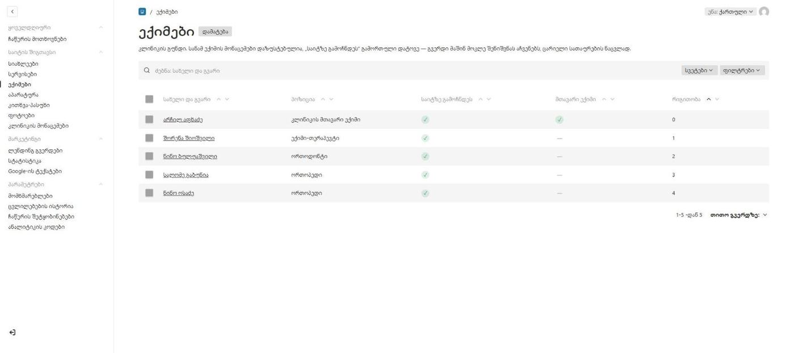
<figcaption>ორი ჩექბოქსი სიაშივე ჩანს: ✓ ნიშნავს ჩართულს, — გამორთულს.</figcaption>
</figure>


ფორმა იმის მიხედვითაა აწყობილი, თუ როგორ ივსება პროფილი რეალურად: ის, რასაც რეგისტრატორი კითხვის გარეშე უპასუხებს, ყოველთვის ჩანს; ის, რაც ექიმისგან ქაღალდზე მოგვიანებით მოდის — დაკეცილ ბლოკებშია.

## გვერდითი სვეტი — ორი ჩექბოქსი

| ველი | |
|---|---|
| **საიტზე გამოჩნდეს** | გამორთულია ნაგულისხმევად |
| **მთავარი ექიმი** | ერთი უნდა იყოს მონიშნული |
| **გამოცდილების წლები** | ჩნდება მხოლოდ მაშინ, თუ „მთავარი ექიმი“ მონიშნულია |
| **რიგითობა** | სავალდებულო |
| **მისამართი (slug)** | ავტომატურად ივსება სახელიდან |

**„საიტზე გამოჩნდეს“ გამორთული** ნიშნავს, რომ „ჩვენს შესახებ“ გვერდი წერს „პროფილი მზადდება“ — ცარიელი სათაურების ნაცვლად — და რომ **ექიმის საკუთარი გვერდი არ იქმნება.** სანამ ექიმის მონაცემები დაზუსტებულია, ეს გამორთული დატოვე.

> ეს განზრახაა: გვერდი, რომლის მთელი შიგთავსია წარწერა „პროფილი მზადდება“, Google-ისთვის ცარიელი გვერდია. მედიცინის საიტზე ასეთი გვერდები მთელ დომენს აზარალებს, არა მარტო საკუთარ თავს. ჩექბოქსის ჩართვის წამიდანვე გვერდი ჩნდება, საიტმაპშიც ავტომატურად.

**„მთავარი ექიმი“** — მთავარ ექიმს გვერდის თავში დიდი ბლოკი ეთმობა. **„გამოცდილების წლები“** სწორედ იმ ბლოკზე გამოსახული დიდი ციფრია (მაგ.: `20+`) და სხვაგან არსად ჩანს. ამიტომაც ჩნდება ველი მხოლოდ მაშინ, როცა ჩექბოქსი მონიშნულია — ველი, რომელსაც შედეგი არ აქვს, უარესია, ვიდრე ველი, რომელიც არ არსებობს.

**მისამართი** ორ ადგილას მუშაობს: ეს არის ექიმის გვერდის URL — `/ka/about/archil-apkhadze` — და იმავდროულად ღუზა „ჩვენს შესახებ“ გვერდზე: `/ka/about#archil-apkhadze`.

**არსებული მისამართი არასდროს გადაიწერება** — მაშინაც კი, თუ სახელში შეცდომას ასწორებ. ეს განზრახაა: მისამართი უკვე გაზიარებულ ბმულში შეიძლება იჯდეს, ვიზიტკაზე ან რეკლამაში.

<figure>
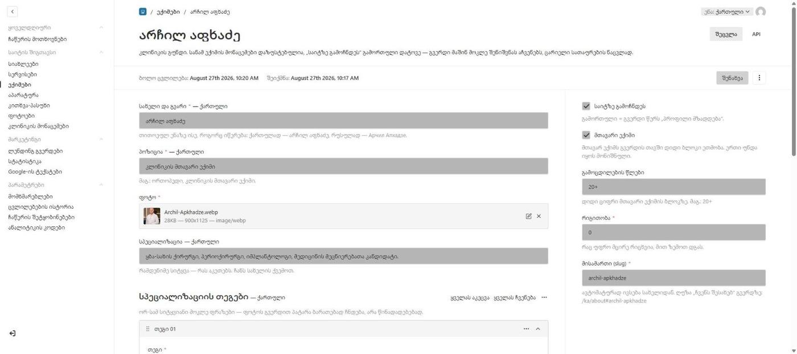
<figcaption>მთავარი ექიმის პროფილი. „გამოცდილების წლები“ სწორედ იმიტომ ჩანს, რომ „მთავარი ექიმი“ მონიშნულია.</figcaption>
</figure>


## მთავარი სვეტი

| ველი | სავალდებულო | ითარგმნება |
|---|---|---|
| **სახელი და გვარი** | ✓ | ✓ |
| **პოზიცია** | ✓ | ✓ |
| **ფოტო** | ✓ | — |
| **სპეციალიზაცია** | — | ✓ |
| **სპეციალიზაციის თეგები** | — | ✓ |
| **ბიოგრაფია** | — | ✓ |

**სახელი ითარგმნება** — თითოეულ ენაზე ისე, როგორც იწერება: ქართულად „არჩილ აფხაძე“, რუსულად „Арчил Апхадзе“. ეს განსხვავდება აპარატის მოდელისგან, რომელიც არ ითარგმნება: პიროვნების სახელი რეალურად გადადის სხვა დამწერლობაში, მოდელის ნომერი — არა.

**სპეციალიზაცია** რამდენიმე სიტყვაა და სახელის ქვემოთ ჩანს.

**სპეციალიზაციის თეგები** — ორ-სამსიტყვიანი მოკლე ფრაზები. ისინი ფოტოს გვერდით პატარა ბარათებად ჩნდება, არა წინადადებებად. გრძელი ტექსტი აქ დიზაინს ტეხს.

**ბიოგრაფია** — ორ-სამი აბზაცი. ეს არის ის, რასაც პაციენტი ექიმის შესახებ წაიკითხავს. ველს ფორმატირების ზოლი აქვს — იხილე **თავი 2 → ტექსტის რედაქტორი**.

## ოთხი დაკეცილი ბლოკი

- **განათლება**
- **გამოცდილება**
- **ტრენინგები და კონგრესები**
- **ენები**

თითოეული სიაა — თითო ჩანაწერი ცალკე სტრიქონად. ოთხივე ითარგმნება.

> **ტრენინგებზე.** ყველაზე ძლიერი ათი-თორმეტი ჩანაწერი აჯობებს სრულ ჩამონათვალს. სამოცი ჩანაწერი ხმაურად იკითხება და პაციენტი გვერდს უვლის.

> **ენებში** მიუთითე მხოლოდ ის, რაც ექიმმა დაადასტურა.

## Google-ის ჩანაწერი (დაკეცილი ბლოკი)

| ველი | |
|---|---|
| **სათაური Google-ისთვის** | სასურველია ~60 სიმბოლო · ველი იტევს მაქსიმუმ 65-ს |
| **აღწერა Google-ისთვის** | სასურველია ~155 სიმბოლო · ველი იტევს მაქსიმუმ 175-ს |
| **საკვანძო სიტყვა** | შიდა ჩანაწერი — გვერდზე არ ჩნდება |

ეს ველები **ექიმის საკუთარ გვერდს** ეხება. ცარიელი დატოვე და გამოიყენება „სახელი — პოზიცია“ და „სპეციალიზაცია“ — უმეტეს შემთხვევაში სწორედ ესაა საჭირო.

შეავსე მაშინ, როცა ექიმის სპეციალიზაცია იმაზე უფრო ვიწროა, ვიდრე მისი პოზიცია ამბობს. „ორთოდონტი“ პოზიციაა; „ბრეკეტები და ინვიზალაინი მოზრდილებისთვის“ — ის, რასაც პაციენტი ეძებს.

> **სახელი ნუ ამოაგდებ სათაურიდან.** ეს ერთადერთი გვერდია საიტზე, რომელსაც სახელით ეძებენ. „ორთოდონტი თბილისში“ სათაურად ამ გვერდს იმ ერთადერთ უპირატესობას აკარგვინებს, რომელიც აქვს.

საკვანძო სიტყვის შესახებ — იხილე თავი 5.

---

# 8. აპარატურა

**მენიუ:** საიტის შიგთავსი → აპარატურა

კლინიკის აპარატები და სისტემები. ჩანს მთავარ გვერდზე და „ტექნოლოგიების“ გვერდზე.

<figure>
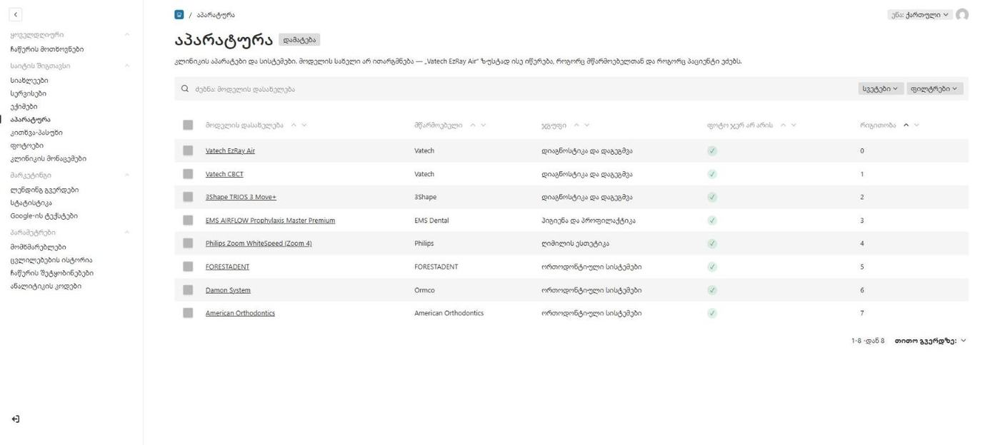
<figcaption>აპარატურის სია. მოდელის დასახელება სამივე ენაზე ერთნაირად იწერება.</figcaption>
</figure>


## ოთხი ჯგუფი

- დიაგნოსტიკა და დაგეგმვა
- ჰიგიენა და პროფილაქტიკა
- ღიმილის ესთეტიკა
- ორთოდონტიული სისტემები

## გვერდითი სვეტი

| ველი | |
|---|---|
| **ჯგუფი** | სავალდებულო |
| **რიგითობა** | სავალდებულო, ჯგუფის შიგნით |
| **ფოტო ჯერ არ არის** | **ჩართულია ნაგულისხმევად** |
| **მისამართი (slug)** | ავტომატურად ივსება დასახელებიდან |

**„ფოტო ჯერ არ არის“ ჩართული** ნიშნავს, რომ ბარათზე წარწერა „ფოტო მზადდება“ გამოჩნდება. თავდაპირველი სურათები დროებითია — **გამორთე მაშინ, როცა რეალურ ფოტოს ატვირთავ.**

## მთავარი სვეტი

| ველი | სავალდებულო | ითარგმნება |
|---|---|---|
| **მოდელის დასახელება** | ✓ | **არა** |
| **მწარმოებელი** | ✓ | არა |
| **მწარმოებლის საიტი** | ✓ | არა |
| **ფოტო** | — | — |
| **სად გამოიყენება** | — | — |
| **ერთი წინადადება** | ✓ | ✓ |
| **ტექსტი** | ✓ | ✓ |
| **მთავარი ფაქტები** | — | ✓ |

> **მოდელის დასახელება არ ითარგმნება.** „Vatech EzRay Air“ სამივე ენაზე ერთნაირად იწერება — ზუსტად ისე, როგორც მწარმოებელთან და როგორც პაციენტი ეძებს. ტრანსლიტერაცია („КТ Vatech“) ტეხს იმ დამთხვევას, რომელსაც ძებნა ეყრდნობა, და შეცდომად იკითხება.

**მწარმოებლის საიტი** სავალდებულოა და **Google-საც მიეწოდება** — ამიტომ ოფიციალური მისამართი უნდა იყოს, ზუსტი.

**სად გამოიყენება** — სერვისების არჩევა. ბარათიდან ბმულები სწორედ ამ სერვისებზე გაიყვანება.

**მთავარი ფაქტები** — ორ-სამი მოკლე ფაქტი. **სწორედ ესენი ხვდება Google-ის პასუხებში**, ამიტომ თითოეული თვითკმარი უნდა იყოს.

---

# 9. კითხვა-პასუხი

**მენიუ:** საიტის შიგთავსი → კითხვა-პასუხი

ჩანს მთავარ გვერდზე, ჩაწერის ფორმის უშუალოდ წინ.

| ველი | სავალდებულო | ითარგმნება |
|---|---|---|
| **კითხვა** | ✓ | ✓ |
| **პასუხი** | ✓ | ✓ |
| **რიგითობა** | ✓ | არა |

> ## ეს თავი ყველაზე ყურადღებით წაიკითხე
>
> **აქ დაწერილი პასუხები Google-ს სტრუქტურირებული სახით მიეწოდება.** ეს ნიშნავს, რომ ისინი შეიძლება პირდაპირ, სიტყვასიტყვით გამოჩნდეს ძებნის შედეგებში და AI-ასისტენტების პასუხებში — შენი გვერდის გახსნის გარეშე.
>
> დაწერე ისე, თითქოს ციტატაა. **პირველი წინადადება თვითკმარი უნდა იყოს** — სწორედ ის ხვდება ციტატაში.
>
> პასუხი მარტივი ტექსტია, ფორმატირების გარეშე — გამუქება, სიები და ბმულები აქ არ მუშაობს.

**რიგითობა** — რაც უფრო მცირე რიცხვია, მით ზემოთ.

> **გაითვალისწინე:** თუ კონსულტაციის ფასი შეიცვალა, აქ ერთ პასუხში თანხა ტექსტში წერია და ავტომატურად არ განახლდება. იხილე თავი 4.

---

# 10. ფოტოები

**მენიუ:** საიტის შიგთავსი → ფოტოები

საიტის ყველა ფოტო და სურათი — ერთი საერთო ბიბლიოთეკა.

> **აქ არ არის** ლოგო, ხატულები და მთავარი ვიდეო. ისინი დიზაინის ნაწილია და კოდში ცხოვრობს.

## ატვირთვა

ატვირთე სურათი. სისტემა ავტომატურად:

- გადაიყვანს **WebP** ფორმატში;
- დაამზადებს სამ ზომას — 480px, 900px და 1600px — რომ ბარათმა 1600px-იანი ორიგინალი არ ჩამოტვირთოს 400px-ზე გამოსაჩენად.

დაშვებულია მხოლოდ სურათები.

<figure>
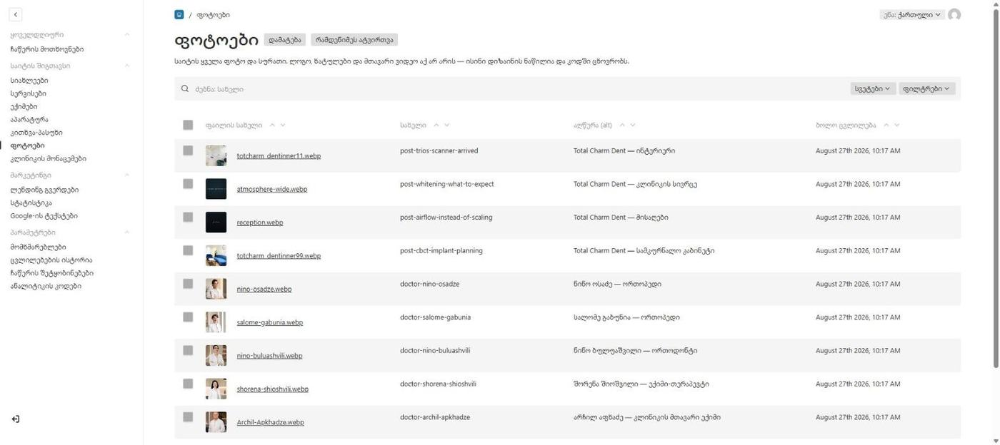
<figcaption>ბიბლიოთეკა. პირველი სვეტი თავად სურათია — ამიტომ ფოტოს პოვნა თვალით შეიძლება.</figcaption>
</figure>


## ველები

| ველი | სავალდებულო | ითარგმნება |
|---|---|---|
| **სახელი** | — | არა |
| **აღწერა (alt)** | ✓ | ✓ |
| **ხელმოწერა** | — | ✓ |

**სახელი** მხოლოდ იმისთვისაა, რომ ბიბლიოთეკაში იპოვო — საიტზე არ ჩანს. ცარიელი დატოვე და ფაილის სახელი ავტომატურად ჩაიწერება.

**აღწერა (alt)** სავალდებულოა. ეს არის ის, რასაც ხედავს ეკრანის მკითხველი და სურათების ძებნა.

> **ეს ხელმოწერა არ არის.** დაწერე რა ჩანს სურათზე:
> - ✓ „ნინო ოსაძე, ორთოპედი“
> - ✗ „ექიმის ფოტო“

**ხელმოწერა** არასავალდებულოა და სურათის ქვემოთ ჩანს იქ, სადაც დიზაინი ითვალისწინებს.

## ფოკუსის წერტილი

პორტრეტები 4:5-ზე იჭრება, აპარატები — 4:3-ზე. **ფოკუსის წერტილი** საშუალებას გაძლევს თავად გადაწყვიტო, რა გადარჩება ჩამოჭრისას — კადრის ცენტრს ნუ მიანდობ.

## წაშლა

სურათის წაშლამდე გადაამოწმე, სად გამოიყენება. წაშლილი სურათი იმ ჩანაწერებში, სადაც მიბმულია, ცარიელ ადგილს ტოვებს.

---

# 11. ლენდინგ გვერდები

**მენიუ:** მარკეტინგი → ლენდინგ გვერდები

სარეკლამო კამპანიის ცალკეული გვერდები. მისამართი: `/ka/slug`.

ეს ყველაზე დიდი ეკრანია პანელში — და ამავე დროს ის, სადაც ყველაზე ცოტა რამის შევსებაა საჭირო.

<figure>
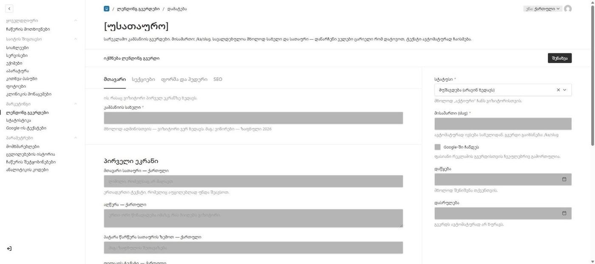
<figcaption>ახალი კამპანია. ოთხი თაბი ზემოთ, სტატუსი და მისამართი — მარჯვნივ.</figcaption>
</figure>


> ## სავალდებულოა მხოლოდ ორი რამ
>
> **კამპანიის სახელი** და **მთავარი სათაური**. სულ ეს.
>
> ყველა დანარჩენი ველი არასავალდებულოა და **ცარიელი ველი ავტომატურად ივსება** — გვერდი მზა ტექსტს ჩასვამს, ხვრელს არ დატოვებს. ანუ სამ წუთში შეგიძლია გამართული კამპანიის გვერდი გამოაქვეყნო და დანარჩენი მოგვიანებით დახვეწო.
>
> სავალდებულოობა მხოლოდ **ქართულს** ეხება. ინგლისური და რუსული ვერსია არასდროს გიშლის შენახვაში ხელს.

## გვერდითი სვეტი

| ველი | |
|---|---|
| **სტატუსი** | მუშავდება (არავინ ხედავს) · აქტიური · დასრულებული |
| **მისამართი (slug)** | ავტომატურად ივსება სახელიდან. გვერდი გაიხსნება: `/ka/slug` |
| **Google-ში ჩანდეს** | ფასიანი რეკლამის გვერდისთვის ჩვეულებრივ **გამორთულია** |
| **დაწყება** | მხოლოდ შენიშვნა შენთვის |
| **დასრულება** | მხოლოდ შენიშვნა — **გვერდს ავტომატურად არ ხურავს** |
| **დასრულების შემდეგ** | რა მოხდეს, როცა სტატუსს „დასრულებულზე“ გადაიყვან |
| **გადამისამართება** | რომელ კამპანიაზე — ჩნდება მხოლოდ საჭიროებისას |

**სამი სტატუსი, სამი ქცევა:**

- **მუშავდება** — გვერდი ვიზიტორისთვის საერთოდ არ არსებობს;
- **აქტიური** — გვერდი ჩვეულებრივ იხსნება;
- **დასრულებული** — გვერდი კვლავ იხსნება, მაგრამ ის, რასაც აჩვენებს, დამოკიდებულია ველზე **„დასრულების შემდეგ“**.

> **„დაწყება“ და „დასრულება“ ტაიმერი არ არის.** ეს ორი თარიღი შენიშვნაა თქვენთვის — გვერდი თავად არ იხურება. კამპანიის დასრულებისას სტატუსი ხელით უნდა შეცვალო.

**„დასრულების შემდეგ“** სამი ვარიანტია:

- **„კამპანია დასრულდა“ ეკრანი** — ვიზიტორი ხედავს თავაზიან შეტყობინებას;
- **სხვა კამპანიაზე გადამისამართება** — ავირჩევ სად;
- **გვერდი ისევ ღიად დარჩეს**.

## თაბი „მთავარი“

### კამპანიის სახელი

სავალდებულო. ეს არის ის, რითაც კამპანიას სიაში იპოვი — და საიდანაც მისამართი ავტომატურად გამოითვლება.

### პირველი ეკრანი

ის, რასაც ვიზიტორი დაუყოვნებლივ ხედავს.

| ველი | |
|---|---|
| **მთავარი სათაური** | **ერთადერთი სავალდებულო ტექსტი** |
| **აღწერა** | |
| **პატარა წარწერა სათაურის ზემოთ** | |
| **ღილაკის ტექსტი** | ცარიელი დატოვე და ავტომატური ტექსტი ჩაისმება |
| **განლაგება** | ხუთი ვარიანტი |
| **სურათი (კომპიუტერი)** | სასურველი ზომა **1920 × 1200 px** |
| **სურათი (მობილური)** | არასავალდებულო, **1080 × 1350 px** |

**განლაგების ხუთი ვარიანტი:**

- სურათი მარჯვნივ
- სურათი მარცხნივ
- სურათი მთელ ეკრანზე *(ყველაზე ეფექტური)*
- ცენტრში, სურათი ქვემოთ
- მხოლოდ ტექსტი

> **სურათის გარეშე ყველა ვარიანტი ერთნაირად, ტექსტად გამოჩნდება.** განლაგების არჩევას აზრი აქვს მხოლოდ მაშინ, როცა სურათი ატვირთული გაქვს.

მთავარ სურათზე **მნიშვნელოვანი ობიექტი ცენტრთან ახლოს დატოვე** — კიდეები სხვადასხვა ეკრანზე სხვადასხვაგვარად იჭრება.

მობილურის სურათი არასავალდებულოა: თუ ცარიელია, კომპიუტერის სურათი გამოიყენება.

### რატომ დაგვიტოვოთ ნომერი

მოკლე ბლოკი სათაურითა და ტექსტით — რას იღებს პაციენტი სანაცვლოდ.

## თაბი „სექციები“

**ჩართე მხოლოდ ის, რაც ამ კამპანიას სჭირდება.** თითოეულ სექციას აქვს საკუთარი ჩექბოქსი **„სექციის ჩვენება“**, რომელიც ნაგულისხმევად გამორთულია. სანამ არ ჩართავ, სექციის ველები არც კი გამოჩნდება.

| სექცია | რა არის |
|---|---|
| **პრობლემა → გადაწყვეტა** | პატარა წარწერა, სათაური, ტექსტი |
| **ექიმი** | აირჩევ ექიმს სიიდან, დაწერ სათაურსა და ტექსტს |
| **რა ხდება შემდეგ** | სათაური და ტექსტი — მაგ. „დაგირეკავთ“ |
| **პაციენტების შეფასებები** | სათაური + **მაქსიმუმ 3 შეფასება** |
| **კლინიკა** | ფოტო, სათაური, ტექსტი |
| **დამამთავრებელი მოწოდება** | მუქი ბლოკი გვერდის ბოლოს |
| **„კამპანია დასრულდა“ ეკრანი** | ჩანს მხოლოდ დასრულებულ კამპანიაზე |

### შეფასებებზე — მნიშვნელოვანი

თითო შეფასება სამი ველია: **ციტატა**, **სახელი**, **წყარო** (მაგ.: Google Reviews).

> **გამოაქვეყნე მხოლოდ ის შეფასებები, რომელთა დადასტურებაც კლინიკას შეუძლია.** გამოგონილი შეფასება სამედიცინო საიტზე იურიდიული რისკია, არა მარკეტინგული ხრიკი.

### „რა ხდება შემდეგ“ — რატომ არსებობს

ეს ბლოკი პაციენტს უხსნის, რომ **ფორმის გაგზავნა ჯერ არ ნიშნავს დაჯავშნილ ვიზიტს**. ის ამცირებს იმ ზარების რაოდენობას, სადაც პაციენტი ფიქრობს, რომ უკვე ჩაწერილია.

## თაბი „ფორმა და ჰედერი“

### ფორმა

| ველი | |
|---|---|
| **სათაური** | მაგ.: „დატოვეთ ნომერი“ |
| **ტექსტი** | |
| **ღილაკი** | მაგ.: „გამოგზავნა“ |
| **მადლობის სათაური** | მაგ.: „მოთხოვნა მიღებულია“ |
| **მადლობის ტექსტი** | რას ხედავს პაციენტი გაგზავნის შემდეგ |

**რომელი ველები იყოს ფორმაში** — ოთხი ჩექბოქსი:

- **მიმართულების არჩევა**
- **სასურველი დრო**
- **ელ. ფოსტა**
- **შეტყობინება**

> **რაც უფრო მოკლეა ფორმა, მით მეტი ივსება.** სარეკლამო გვერდზე სახელი და ტელეფონი ჩვეულებრივ საკმარისია — დანარჩენი დარეკვისას ირკვევა. სამივე დამატებითი ველი ნაგულისხმევად გამორთულია და ეს განზრახაა.

**კამპანიის მიმართულება** — თუ კამპანია კონკრეტულ სერვისზეა (მაგ. ვინირები), აირჩიე აქ და ის ავტომატურად ჩაიწერება ჩაწერის მოთხოვნაში.

### ზედა ზოლი

**სამი ვარიანტი:**

- ლოგო, ტელეფონი, ღილაკი
- ლოგო, ნდობის ტექსტი, ტელეფონი, ღილაკი
- მხოლოდ ლოგო და ღილაკი

**ნდობის ტექსტი** ჩანს მხოლოდ მეორე ვარიანტში.

დამატებით: **ტელეფონის ჩვენება** (ჩართულია ნაგულისხმევად) და **ღილაკის ტექსტი**.

## თაბი „SEO“

| ველი | თუ ცარიელია |
|---|---|
| **სათაური** | გამოიყენება მთავარი სათაური |
| **აღწერა** | გამოიყენება პირველი ეკრანის აღწერა |
| **გაზიარების სურათი** | გამოიყენება პირველი ეკრანის სურათი |
| **საკვანძო სიტყვა** | შიდა ჩანაწერი — არსად არ ჩნდება |

პირველი სამი ის ტექსტია, რომელიც Google-სა და სოციალურ ქსელებში გაზიარებისას ჩანს.

**საკვანძო სიტყვა** აქ განსაკუთრებით გამოსადეგია: კამპანია რამდენიმე კვირაში მთავრდება და ერთი წლის შემდეგ არავის ახსოვს, რომელ სარეკლამო მოთხოვნაზე იყო ეს გვერდი აწყობილი. ერთი სტრიქონი ამას ინახავს. იხილე თავი 5.

## კამპანიის შედეგის ნახვა

ყოველი ჩაწერის მოთხოვნა, რომელიც ლენდინგიდან მოვა, ავტომატურად ინახავს კამპანიის სახელს, მისამართსა და რეკლამის წყაროს. იხილე თავი 3 → **„საიდან მოვიდა“**.

---

# 12. Google-ის ტექსტები

**მენიუ:** მარკეტინგი → Google-ის ტექსტები

რა წერია ბრაუზერის ჩანართზე და Google-ის შედეგებში თითოეული გვერდისთვის.

ეკრანი ორ თაბად იყოფა:

<figure>
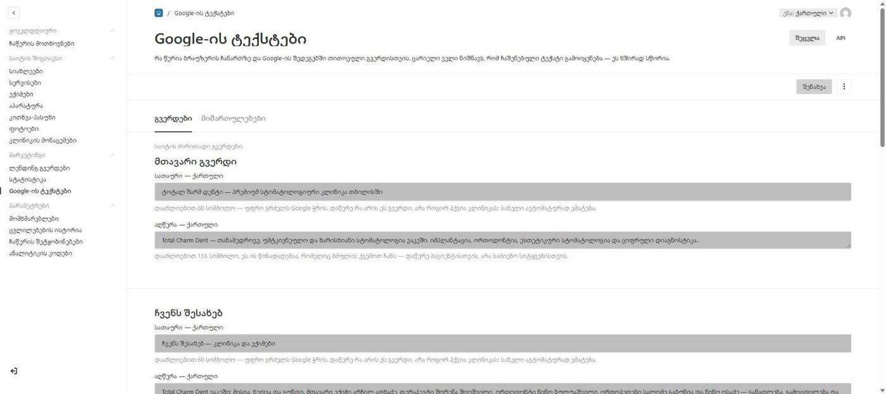
<figcaption>თითოეულ გვერდს ორი ველი აქვს — სათაური და აღწერა, სამივე ენაზე ცალ-ცალკე.</figcaption>
</figure>


### თაბი „გვერდები“

- მთავარი გვერდი
- ჩვენს შესახებ
- სერვისები
- ტექნოლოგიები
- სიახლეები
- კონტაქტი

### თაბი „მიმართულებები“

სერვისების ხუთი მიმართულების გვერდი.

## თითოეულ გვერდზე სამი ველი

| ველი | სასურველი სიგრძე | |
|---|---|---|
| **სათაური** | ~60 სიმბოლო | უფრო გრძელს Google ჭრის. ველი იტევს 90-მდე. |
| **აღწერა** | ~155 სიმბოლო | ეს ის წინადადებაა, რომელიც ბმულის ქვემოთ ჩანს. ველი იტევს 320-მდე. |
| **საკვანძო სიტყვა** | — | შიდა ჩანაწერი. არსად არ ქვეყნდება — იხილე თავი 5. |

> **სიმბოლოების ლიმიტი რეკომენდაცია არ არის, ტექნიკური ზღვარია.** Google გრძელ ტექსტს **ჭრის, არ უარყოფს** — ამიტომ ველი უფრო მეტს იტევს, ვიდრე სასურველია. თუ 60-ს გადააჭარბე, შეცდომას არ მიიღებ; უბრალოდ დაბოლოება ძებნის შედეგებში არ გამოჩნდება.

სამივე ითარგმნება — სამივე ენაზე ცალ-ცალკე. საკვანძო სიტყვაც: ქართული, ინგლისური და რუსული გვერდი სამ სხვადასხვა ძებნაზე მუშაობს.

> **ცარიელი ველი ნიშნავს, რომ ჩაშენებული ტექსტი გამოიყენება — და ეს ხშირად სწორია.** შეავსე მაშინ, როცა კონკრეტული მიზეზი გაქვს.

**სათაურში დაწერე რა არის ეს გვერდი, არა როგორ ჰქვია კლინიკას** — სახელი ავტომატურად ემატება. „იმპლანტაცია“ სჯობს „Total Charm Dent — იმპლანტაცია“-ს.

**აღწერა დაწერე პაციენტისთვის, არა საძიებო სიტყვებისთვის.** სიტყვების დაგროვება დღეს არ მუშაობს; ერთი გასაგები წინადადება — მუშაობს.

## რატომ არ არის აქ ყველაფერი

ამ ეკრანზე მხოლოდ **ფიქსირებული გვერდებია** — ის თერთმეტი, რომელიც საიტს ყოველთვის აქვს. დანარჩენი ორ სხვა ლოგიკას მისდევს:

| რა | სად არის მისი Google-ის ტექსტი | რატომ |
|---|---|---|
| სტატია | თავად სტატიაში (თავი 5) | თითოეულს თავისი მისამართი აქვს |
| ექიმი | თავად ექიმის ჩანაწერში (თავი 7) | თითოეულს თავისი გვერდი აქვს |
| ლენდინგი | თავად ლენდინგში, თაბი „SEO“ (თავი 11) | თითოეულს თავისი მისამართი აქვს |
| სერვისი | **არსად — და არც სჭირდება** | გვერდი არ არის: მიმართულების გვერდზე ღუზად ჩნდება |
| აპარატი | **არსად — და არც სჭირდება** | გვერდი არ არის: ტექნოლოგიების გვერდზე ღუზად ჩნდება |

**წესი მარტივია: სადაც საკუთარი მისამართია, იქვეა Google-ის ტექსტიც.** ამ ეკრანზე მხოლოდ ის გვერდებია, რომლებსაც ცალკე ჩანაწერი არ აქვთ.

> **ყველა საკვანძო სიტყვა ერთად რომ ნახო** — მენიუს ბოლოში, „სახელმძღვანელოს“ ზემოთ, არის **„საკვანძო სიტყვები“**. იქ ერთ სიაშია ყველა გვერდი, სამივე ენაზე. იხილე თავი 13.

> **სერვისსა და აპარატს ეს ველები განზრახ არ აქვს.** `<title>` გვერდს ეკუთვნის, ღუზას — არა. ველი, რომელსაც შედეგი არ ექნებოდა, უარესია, ვიდრე ველი, რომელიც არ არსებობს: შეავსებდი და ელოდებოდი შედეგს, რომელიც არასდროს დადგებოდა.

---

# 13. საკვანძო სიტყვები

**მენიუ:** ყველა ჯგუფის ქვემოთ, „სახელმძღვანელოს“ ზემოთ

ერთი სია: ყველა გვერდი და მისი საკვანძო სიტყვა, სამივე ენაზე.

**ეს ეკრანი მხოლოდ საკითხავია.** შესაცვლელად დააჭირე გვერდის სახელს — გადახვალ იმ ჩანაწერზე, სადაც ტექსტი წერია, და იქ ჩაასწორებ. ერთი მნიშვნელობა ორ ადგილას რომ იცვლებოდეს, ადრე თუ გვიან ორი სხვადასხვა მნიშვნელობა გახდებოდა.

## რატომ არსებობს

საკვანძო სიტყვა თითოეულ ჩანაწერშია, დაკეცილ ბლოკში — და **წერისთვის ეს სწორი ადგილია.** კითხვისთვის — არა: რომ გაგეგო „რა სიტყვებზე ვმუშაობ საიტზე“, უნდა გაგეხსნა თერთმეტი ჯგუფი „Google-ის ტექსტებში“, პლუს ყოველი სტატია, ყოველი ექიმი და ყოველი ლენდინგი, სათითაოდ, სამივე ენაზე.

## ოთხი ბლოკი

| ბლოკი | რა შედის |
|---|---|
| **ფიქსირებული გვერდები** | თერთმეტივე — მთავარიდან ხუთ მიმართულებამდე |
| **სიახლეები** | მხოლოდ გამოქვეყნებული სტატიები |
| **ექიმები** | მხოლოდ ისინი, ვისაც „საიტზე გამოჩნდეს“ ჩართული აქვს |
| **ლენდინგ გვერდები** | ყველა კამპანია, სტატუსის მიუხედავად |

## ტირე ცარიელ უჯრაში

**ტირე შეცდომა არ არის.** ის იმას ნიშნავს, რომ ამ გვერდზე, ამ ენაზე, ჯერ არ გადაწყვეტილა, რომელ ძებნაზე მუშაობს.

სწორედ ეს არის ეკრანის მთავარი სარგებელი: ცარიელი სვეტი ინგლისურის გასწვრივ მაშინვე ჩანს, დაკეცილ ბლოკში კი — არასდროს.

## „Google-ის სათაური არ არის“

ეს ნაცრისფერი წარწერა ქართული სვეტის ქვეშ ჩნდება, როცა იმ გვერდს Google-ის სათაური არ აქვს შევსებული.

**ესეც არ არის ხარვეზი.** ცარიელი სათაური ნიშნავს, რომ ჩაშენებული ტექსტი გამოიყენება — და ხშირად სწორედ ესაა საჭირო. წარწერა უბრალოდ გახსენებს, რომ ამ გვერდზე ეს არჩევანი ჯერ არავის გაუკეთებია.

---

# 14. სტატისტიკა

**მენიუ:** მარკეტინგი → სტატისტიკა · _მხოლოდ ადმინისტრატორი_

ანონიმური დღიური ჯამები. ჩანაწერები ავტომატურად იქმნება და **არავის შეუძლია მათი შეცვლა ან წაშლა.**

| სვეტი | |
|---|---|
| **თარიღი** | კალენდარული დღე UTC-ით (წწწწ-თთ-დდ) |
| **მოვლენა** | გვერდის ნახვა · ჩაწერის ფორმა გაიხსნა · ჩაწერა დასრულდა |
| **გვერდი** | ივსება მხოლოდ გვერდის ნახვისთვის |
| **რაოდენობა** | |

> **აქ არ ინახება ვიზიტორის იდენტიფიკატორი, სესია, cookie, ციფრული ანაბეჭდი ან IP მისამართი.** მხოლოდ ჯამები. ეს არჩევანი განზრახაა — ის ამცირებს პერსონალურ მონაცემებთან დაკავშირებულ ვალდებულებებს და ამავე დროს იმ კითხვებზე პასუხობს, რომლებიც კლინიკას რეალურად აინტერესებს: რამდენმა ნახა, რამდენმა გახსნა ფორმა, რამდენმა დაასრულა.

**ჩაწერის კონვერსია** ამ სამი რიცხვის ურთიერთობაა: ნახვა → ფორმის გახსნა → დასრულება.

---

# 15. პარამეტრები

## მომხმარებლები

**მენიუ:** პარამეტრები → მომხმარებლები

ვის შეუძლია პანელში შესვლა.

| ველი | |
|---|---|
| **სახელი** | სავალდებულო |
| **ელ. ფოსტა** | შესვლისთვის |
| **როლი** | ადმინისტრატორი ან რედაქტორი |

### ვის რა შეუძლია

| მოქმედება | რედაქტორი | ადმინისტრატორი |
|---|---|---|
| კოლეგების სიის ნახვა | ✓ | ✓ |
| საკუთარი სახელისა და პაროლის შეცვლა | ✓ | ✓ |
| **საკუთარი როლის შეცვლა** | ✗ | — |
| ახალი ანგარიშის შექმნა | ✗ | ✓ |
| ანგარიშის წაშლა | ✗ | ✓ |
| როლის მინიჭება | ✗ | ✓ |

> **რედაქტორს საკუთარი როლის შეცვლა არ შეუძლია.** ეს ტექნიკურად დაცულია, არა მხოლოდ ინტერფეისში დამალული — წინააღმდეგ შემთხვევაში ყველა დანარჩენი წესი დეკორაცია იქნებოდა.

### ბოლო ადმინისტრატორის დაცვა

**სისტემა არ დაუშვებს ბოლო ადმინისტრატორის ანგარიშის წაშლას.** ცდისას მიიღებ შეტყობინებას:

> „ეს ერთადერთი ადმინისტრატორის ანგარიშია. სანამ წაშლი, სხვა მომხმარებელი ადმინისტრატორად აქციე.“

ეს არ არის ზედმეტი სიფრთხილე: ბოლო ადმინისტრატორის წაშლა პანელს **სამუდამოდ** კეტავს — აღდგენა მხოლოდ ბაზაში პირდაპირი ჩარევით შეიძლება.

---

## ჩაწერის შეტყობინებები

**მენიუ:** პარამეტრები → ჩაწერის შეტყობინებები · _მხოლოდ ადმინისტრატორი_

| ველი | |
|---|---|
| **შეტყობინების მისამართი** | სად მოდის წერილი ახალ ჩაწერაზე |

> **ეს არ არის კლინიკის საჯარო ფოსტა.** ეს შიდა მისამართია, რომელსაც პაციენტი ვერ ხედავს. საჯარო ფოსტა „კლინიკის მონაცემებში“ იცვლება — თავი 4.

ცარიელი ველი ნიშნავს, რომ სერვერზე მითითებული ნაგულისხმევი მისამართი გამოიყენება.

---

## ანალიტიკის კოდები

**მენიუ:** პარამეტრები → ანალიტიკის კოდები · _მხოლოდ ადმინისტრატორი_

| ველი | ფორმატი |
|---|---|
| **GA4 Measurement ID** | `G-XXXXXXXXXX` |
| **Meta Pixel ID** | 5–20 ციფრი |

**ცარიელი ველი = სერვისი გამორთულია.** არასწორი ფორმატი შენახვისას შეცდომას აჩვენებს.

> **ჩართულიც კი, კოდი მხოლოდ ვიზიტორის თანხმობის შემდეგ ჩაიტვირთება.** სანამ ვიზიტორი cookie-ს ბანერზე თანხმობას არ დააფიქსირებს, არცერთი ანალიტიკის სკრიპტი არ ეშვება.

---

## ცვლილებების ისტორია

**მენიუ:** პარამეტრები → ცვლილებების ისტორია · _მხოლოდ ადმინისტრატორი_

ვინ, რა და როდის შეცვალა.

| სვეტი | |
|---|---|
| **თარიღი** | |
| **ვინ** | რომელი მომხმარებელი |
| **მოქმედება** | დამატება · შეცვლა · წაშლა |
| **რომელი ჩანაწერი** | |
| **სად** | რომელ ეკრანზე |

> **ჩანაწერები ავტომატურად იქმნება და მათი შეცვლა ან წაშლა არავის შეუძლია — არც ადმინისტრატორს.** ეს ტექნიკური შეზღუდვაა, არა პოლიტიკა: ჟურნალი, რომლის რედაქტირებაც შესაძლებელია, ჟურნალი არ არის.

**„რა შეიცვალა“** აჩვენებს მხოლოდ შეცვლილ ველებს — ძველი და ახალი მნიშვნელობით. გრძელი ტექსტი მოკლდება, სტატიის შიგთავსი მხოლოდ აღინიშნება („ტექსტი შეიცვალა“).

**პაროლები და მსგავსი მგრძნობიარე ველები ჟურნალში არასდროს ხვდება** — ისინი ამოღებულია მანამ, სანამ ჩანაწერი შეიქმნება.

### რა არ იწერება

ვებგვერდიდან შემოსული **ახალი ჩაწერის მოთხოვნა ჟურნალში არ ჩნდება** — ის პაციენტმა შექმნა, არა თანამშრომელმა. სამაგიეროდ, როცა თანამშრომელი სტატუსს ცვლის, ეს **იწერება**.

---

# 16. პრობლემების სწრაფი მოგვარება

## შევინახე, მაგრამ საიტზე არაფერი შეიცვალა

**1. სწორი ენა გქონდა არჩეული?**
ყველაზე ხშირი მიზეზი. English-ზე შეცვლილი ტექსტი ქართულ გვერდზე არ გამოჩნდება.

**2. ბრაუზერის ქეში.**
გახსენი გვერდი `Ctrl+Shift+R`-ით (Mac-ზე `Cmd+Shift+R`).

**3. სიახლე ხომ არ არის მონახაზად?**
სიახლეებში „მონახაზის შენახვა“ არ ნიშნავს გამოქვეყნებას.

**4. ექიმს ხომ არ აქვს „საიტზე გამოჩნდეს“ გამორთული?**
გამორთული ჩექბოქსი ექიმის საკუთარ გვერდსაც აქრობს — ბმული 404-ს დააბრუნებს.

**5. ლენდინგის სტატუსი ხომ არ არის „მუშავდება“?**

თუ ხუთივე შემოწმდა და ცვლილება მაინც არ ჩანს — დაუკავშირდი დეველოპერს.

## შენახვა არ გამოდის — წითელი შეცდომა ჩნდება

შეცდომა ზუსტად ასახელებს, რომელი ველია შესავსები. გადაახვიე ფორმის თავში — შეუვსებელი ველები მონიშნულია.

**თუ შეცდომა ველზეა, რომელიც შენ არ შეგიხებია:** სავარაუდოდ სავალდებულო ველია, რომელიც თავიდანვე ცარიელი იყო.

**თუ ინგლისურ ან რუსულ ენაზე ხარ და შეცდომა ცარიელ სავალდებულო ველზეა:** ეს ის ველია, რომელიც ამ ენაზე შეუვსებელია. ან შეავსე, ან გადართე ქართულზე და იქ შეინახე. _(ლენდინგ გვერდები გამონაკლისია — იქ მხოლოდ ქართული მოწმდება.)_

## პაციენტმა თქვა, რომ ფორმა გამოგზავნა, მაგრამ სიაში არ ვხედავ

**1. სია დაალაგე თარიღით** — უახლესი ზემოთ უნდა იყოს.

**2. ფილტრი ხომ არ გიდგას** კონკრეტულ სტატუსზე?

**3. მოძებნე ტელეფონით** — სახელი შეიძლება სხვაგვარად ჩაწერა.

**4. შეამოწმე „სპამი“ სტატუსის ჩანაწერები.**

> **შეტყობინება რომ არ მოსულა, ეს არ ნიშნავს, რომ მოთხოვნა არ არსებობს.** ისინი ორი სხვადასხვა რამაა — იხილე თავი 3.

## სათაური დავადე, ზომა კი არ შეიცვალა ისე, როგორც ველოდი

ეს ალბათ სწორია. რედაქტორის „სათაური“ და „ქვესათაური“ **დონეს** ნიშნავს, არა ზომას — რამდენად ღრმად დგას ეს ნაწილი ტექსტის სტრუქტურაში. ზომას გვერდი ირჩევს: ერთი და იგივე „სათაური“ სტატიაში დიდია, ექიმის ბიოგრაფიაში კი წვრილი, რადგან ბიოგრაფია გვერდის ნაწილია. იხილე თავი 2.

## Google-ის სათაური შევავსე, ძებნაში კი ძველი წერია

ორი შესამოწმებელი:

**1. სწორ ადგილას შეავსე?** სტატიას, ექიმსა და ლენდინგს Google-ის ტექსტი **თავად ჩანაწერშია**, არა „Google-ის ტექსტების“ ეკრანზე. იხილე თავი 12-ის ცხრილი.

**2. დრო.** ინდექსის განახლებას რამდენიმე დღიდან რამდენიმე კვირამდე სჭირდება — იხილე ქვემოთ.

> **საკვანძო სიტყვა ძებნაზე არ მოქმედებს და არც უნდა მოქმედებდეს** — ის შიდა ჩანაწერია. თუ იმას ელოდები, რომ იქ დაწერილი სიტყვა პოზიციას შეცვლის, იხილე თავი 5.

## სერვისს ხატულა გაუქრა

მისამართი (slug) შეიცვალა. **დაუკავშირდი დეველოპერს** — ხატულა კოდში ამ მისამართით არჩევა.

## სურათი აიტვირთა, მაგრამ ცუდად იჭრება

გამოიყენე **ფოკუსის წერტილი** — ჩაწერის შემდეგ სისტემა სწორედ იმ ადგილს შეინარჩუნებს.

## Google ისევ ძველ ინფორმაციას აჩვენებს

Google-ის ინდექსი დაუყოვნებლივ არ ნახლდება — ამას რამდენიმე დღიდან რამდენიმე კვირამდე სჭირდება. საიტზე ცვლილება მაშინვე ჩანს; ძებნის შედეგებში — არა.

**გამონაკლისი:** სამუშაო საათები. Google-ისთვის განკუთვნილი ვერსია კოდშია და ხელით უნდა შეიცვალოს — იხილე თავი 4.

## პანელში ვერ შევდივარ

**1. მისამართი სწორია?** `totalcharmdent.ge/admin`

**2. გამოიყენე „პაროლი დაგავიწყდა?“** — აღდგენის წერილი ფოსტაზე მოვა.

**3. თუ წერილი არ მოდის** — შეამოწმე სპამის საქაღალდე, შემდეგ დაუკავშირდი ადმინისტრატორს.

## მენიუში ეკრანს ვერ ვხედავ

შენი როლისთვის დამალულია. იხილე **დანართი ა**.

---

# დანართი ა — ვინ რას ხედავს

| ეკრანი | რედაქტორი | ადმინისტრატორი |
|---|---|---|
| **ჩაწერის მოთხოვნები** | ✓ ხედავს, სტატუსს ცვლის | ✓ + წაშლა |
| **სიახლეები** | ✓ | ✓ |
| **სერვისები** | ✓ | ✓ |
| **ექიმები** | ✓ | ✓ |
| **აპარატურა** | ✓ | ✓ |
| **კითხვა-პასუხი** | ✓ | ✓ |
| **ფოტოები** | ✓ | ✓ |
| **კლინიკის მონაცემები** | ✓ | ✓ |
| **ლენდინგ გვერდები** | ✓ | ✓ |
| **Google-ის ტექსტები** | ✓ | ✓ |
| **საკვანძო სიტყვები** | ✓ | ✓ |
| **სტატისტიკა** | ✗ | ✓ |
| **მომხმარებლები** | ✓ ხედავს სიას, ცვლის მხოლოდ თავისს | ✓ სრულად |
| **ცვლილებების ისტორია** | ✗ | ✓ |
| **ჩაწერის შეტყობინებები** | ✗ | ✓ |
| **ანალიტიკის კოდები** | ✗ | ✓ |

**კლინიკის მონაცემები რედაქტორისთვისაც ღიაა განზრახ.** ტელეფონის ნომრის გასწორება ჩვეულებრივი სარედაქციო სამუშაოა — ამისთვის ადმინისტრატორის დალოდება არ უნდა იყოს საჭირო.

---

# დანართი ბ — სად რა იცვლება

| მინდა შევცვალო | სად |
|---|---|
| აპარატის აღწერა | საიტის შიგთავსი → აპარატურა |
| ბლოგის სტატია | საიტის შიგთავსი → სიახლეები |
| ბმული Facebook-ზე | საიტის შიგთავსი → კლინიკის მონაცემები → სოციალური ქსელები |
| გამოცდილების წლები (მთავარი ექიმი) | საიტის შიგთავსი → ექიმები → გვერდითი სვეტი |
| ექიმის ბიოგრაფია | საიტის შიგთავსი → ექიმები |
| ექიმის გვერდის მისამართი | საიტის შიგთავსი → ექიმები → მისამართი (slug) |
| ექიმის რიგითობა | საიტის შიგთავსი → ექიმები → რიგითობა |
| ვინ იღებს ჩაწერის შეტყობინებას | პარამეტრები → ჩაწერის შეტყობინებები |
| თანამშრომლის ანგარიში | პარამეტრები → მომხმარებლები |
| კითხვა-პასუხი | საიტის შიგთავსი → კითხვა-პასუხი |
| კლინიკის ელ. ფოსტა (საჯარო) | საიტის შიგთავსი → კლინიკის მონაცემები |
| კონსულტაციის ფასი | საიტის შიგთავსი → კლინიკის მონაცემები |
| მისამართი | საიტის შიგთავსი → კლინიკის მონაცემები |
| რეკლამის გვერდი | მარკეტინგი → ლენდინგ გვერდები |
| სათაური სტატიის ტექსტში | ტექსტის რედაქტორის ზოლი — თავი 2 |
| საკვანძო სიტყვა (შიდა) | იქვე, სადაც იმ გვერდის Google-ის ტექსტია |
| საკვანძო სიტყვების სია | მენიუს ბოლოში → საკვანძო სიტყვები |
| სამუშაო საათები | საიტის შიგთავსი → კლინიკის მონაცემები |
| სერვისის ტექსტი | საიტის შიგთავსი → სერვისები |
| სია ან ბმული ტექსტში | ტექსტის რედაქტორის ზოლი — თავი 2 |
| სურათი | საიტის შიგთავსი → ფოტოები |
| ტელეფონი | საიტის შიგთავსი → კლინიკის მონაცემები |
| ფასი Google-ის შედეგებში | საიტის შიგთავსი → კლინიკის მონაცემები |
| ჩაწერის სტატუსი | ყოველდღიური → ჩაწერის მოთხოვნები |
| წლები ბაზარზე | საიტის შიგთავსი → კლინიკის მონაცემები |
| Google Maps-ის ბმული | საიტის შიგთავსი → კლინიკის მონაცემები |
| Google-ის სათაური (გვერდი) | მარკეტინგი → Google-ის ტექსტები |
| Google-ის სათაური (ექიმი) | საიტის შიგთავსი → ექიმები → Google-ის ჩანაწერი |
| Google-ის სათაური (ლენდინგი) | მარკეტინგი → ლენდინგ გვერდები → თაბი „SEO“ |
| Google-ის სათაური (სტატია) | საიტის შიგთავსი → სიახლეები → Google-ის ჩანაწერი |
| GA4 / Meta Pixel | პარამეტრები → ანალიტიკის კოდები |
| WhatsApp-ის ნომერი | საიტის შიგთავსი → კლინიკის მონაცემები |

---

# დანართი გ — რა იცვლება ენების მიხედვით

**„ითარგმნება“ ნიშნავს, რომ ველი სამივე ენაზე ცალ-ცალკე ივსება.**

| ეკრანი | ითარგმნება | ერთია ყველა ენისთვის |
|---|---|---|
| **სიახლეები** | სათაური, მოკლე აღწერა, ტექსტი, Google-ის სამივე ველი | მისამართი, კატეგორია, თარიღი, მთავარი სურათი |
| **სერვისები** | დასახელება, ერთი წინადადება, შესავალი, რას მოიცავს | მისამართი, მიმართულება, რიგითობა |
| **ექიმები** | სახელი, პოზიცია, სპეციალიზაცია, თეგები, ბიოგრაფია, განათლება, გამოცდილება, ტრენინგები, ენები, Google-ის სამივე ველი | ფოტო, მისამართი, რიგითობა, ორივე ჩექბოქსი, გამოცდილების წლები |
| **აპარატურა** | ერთი წინადადება, ტექსტი, მთავარი ფაქტები | **მოდელის დასახელება**, მწარმოებელი, მწარმოებლის საიტი, ფოტო, ჯგუფი, რიგითობა, მისამართი |
| **კითხვა-პასუხი** | კითხვა, პასუხი | რიგითობა |
| **ფოტოები** | აღწერა (alt), ხელმოწერა | სახელი, თავად ფაილი |
| **კლინიკის მონაცემები** | მისამართი, სამუშაო საათები | ტელეფონები, ელ. ფოსტა, Maps-ის ბმული, ფასები, ციფრები, სოციალური ქსელები |
| **Google-ის ტექსტები** | სათაური, აღწერა, საკვანძო სიტყვა — ყველა გვერდზე | — |
| **ლენდინგ გვერდები** | თითქმის ყველა ტექსტი, SEO-ს სამივე ველი | სტატუსი, მისამართი, თარიღები, ჩექბოქსები, სურათები |

---

*ვერსია 1.1 · შედგენილია ადმინისტრაციული პანელის კოდის მიხედვით*
*The Asylum Agency · theasylum.agency*
